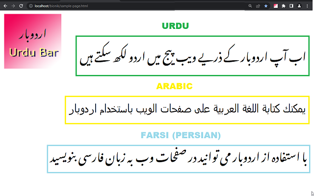

# Udubar Plugin for webbrowser
Urdubar is webbrowser extension for writing Urdu / Arabic in web page.
  
This repo provides source code of UrduBar for Chrome, Edge and FireFox.
 
 

 

### Download Page:
https://www.ajsoftpk.com/urdubar/

### Contact:
urdujini@gmail.com
